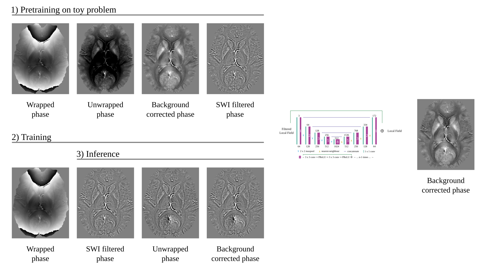

# Homodynenet: Recovering SWI-filtered phase data

This repository contains the code for the paper:

Kames, C, Doucette, J, Birkl, C, Rauscher, A. Recovering SWI-filtered phase data using deep learning. Magn Reson Med. 2021; 87: 948– 959. https://doi.org/10.1002/mrm.29013





## Getting Started

1. Clone this repository:
```sh
git clone https://github.com/kamesy/homodynenet.git
cd homodynenet
```

2. Install the conda environment:
```sh
conda env create -f environment.yml
conda activate homodynenet
```

3. Install [QSM.m](https://github.com/kamesy/QSM.m) for QSM preprocessing.

4. Download the pre-trained weights from

## Usage

### Inference

1. Preprocess the SWI filtered phase by running [`src/preprocess.m`](./src/preprocess.m).

2. Recover the filtered phase. The recovered phase will be stored in a `.mat` with key `fl`.
```sh
python src/homodynenet.py \
    --ckp /path/to/weights \
    --data /path/to/preprocessed \
    [--outdir /path/to/preprocessed] \
    [--suffix homodynenet] # saved as filename_suffix.mat
```

### Training

1. Generate homodyne filtered data from raw phase by running [`src/data/generateHomodyne.m`](./src/data/generateHomodyne.m).
```matlab
% default paths in generateHomodyne.m
INDIR = '../../data/raw';
OUTDIR = '../../data/homodyne';
```

2. Preprocess 3D homodyne data: split into train/val/test sets, store 2D slices, find/remove bad slices.
```sh
python src/data/preprocess.py \
    --data ../../data/homodyne \
    --outdir ../../data/homodynenet \
    [--train_split 0.9]
```

3. Train the model.
```sh
# Pre-train. Hann windows of size 96x96 only
python src/train \
    --data ../../data/homodynenet \
    --logdir ./log \
    --data_filter hann_n_96 \           # regex: file if re.search(data_filter, file)
    --data_x hfl1 \                     # key in .mat file
    --name hann_96_stage_1 \
    --epochs 1000 \
    --epoch_length 1500 \
    --batch_size 32 \
    --patch 128

# Fine-tune. Hann windows of size 96x96 only. Bad slices removed.
python src/train \
    --data ../../data/homodynenet \
    --logdir ./log \
    --ckp ./log/hann_96_stage_1/weights.pt \
    --data_filter hann_n_96 \
    --data_file data_tukey_1.5.txt \    # generated by src/data/preprocess.py
    --data_x hfl2 \                     # key in .mat file
    --name hann_96_stage_2 \
    --epochs 300 \
    --epoch_length 1500 \
    --batch_size 32 \
    --patch 128 \
    --early_stopping 32

# All windows except hann_n_96 and gaussian_n_128.
...
    --data_filter "^(?!.*(hann_n_96|gaussian_n_128))" \
...
```

## Citation

```bibtex
@article{kames2022recovering,
    title = {Recovering SWI-filtered phase data using deep learning},
    author = {Kames, Christian and Doucette, Jonathan and Birkl, Christoph and Rauscher, Alexander},
    journal = {Magnetic Resonance in Medicine},
    volume = {87},
    number = {2},
    pages = {948--959},
    doi = {https://doi.org/10.1002/mrm.29013},
    year = {2022}
}
```
